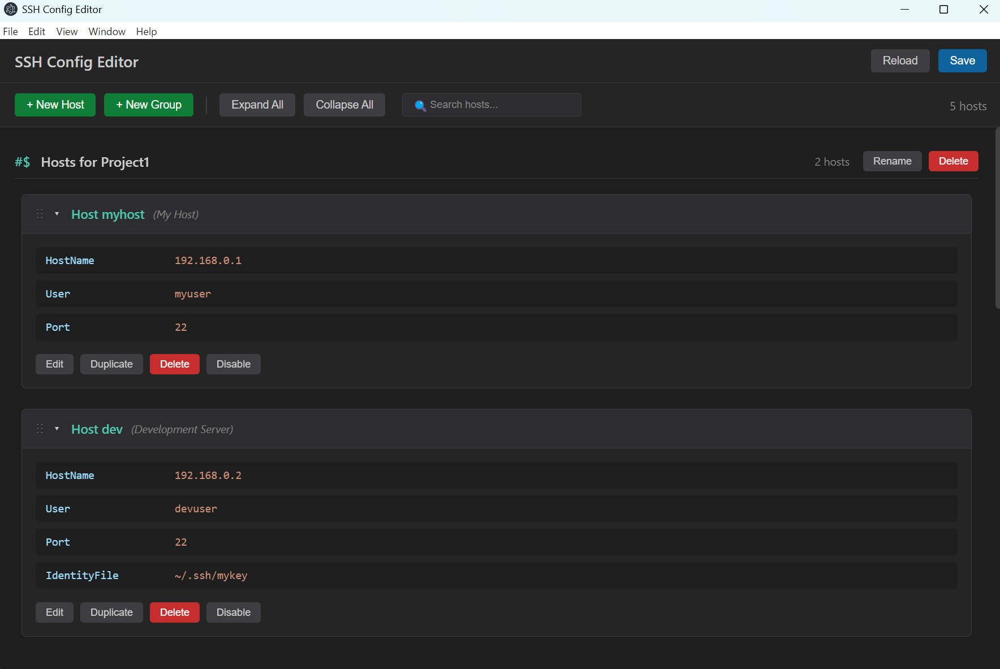

# SSH Config Editor

SSH設定ファイル（`~/.ssh/config`）を視覚的に編集できるモダンなGUIアプリケーション（Windows版）


[English](README.md) | 日本語

## スクリーンショット



## 特徴

### 基本機能
- 🖱️ **直感的なGUI** - SSH設定ファイルを視覚的に編集
- 📁 **折りたたみ表示** - 各ホスト設定を個別に展開・折りたたみ可能
- 🎨 **プロパティエディタ** - 各プロパティタイプに適した入力フォーム
- 💾 **自動フォーマット** - 保存時に適切なインデントと間隔で整形
- 🔒 **自動バックアップ** - 変更保存前に自動的にバックアップを作成
- 🎨 **ダークテーマ** - VS Code風のモダンなUI

### 高度な機能
- 🔍 **検索・フィルタリング** - ホストパターン、タグ、プロパティをリアルタイムに検索
  - 複数キーワード検索（AND条件）
  - 入力に応じて即座にフィルタリング
- 🔄 **ドラッグ&ドロップ** - ホストの並び替えやグループ間の移動が自由自在
- 📋 **グループ管理** - `#$` マーカーを使用してホストをカスタムグループに整理
- 🏷️ **タグサポート** - ホストエントリの上に説明コメントを追加
- ✅ **有効/無効の切り替え** - ホストやプロパティを個別に無効化（コメントアウト）
- 🔢 **複数値プロパティ** - 複数の値を持つプロパティをサポート：
  - `LocalForward`、`RemoteForward`、`DynamicForward`（個別に有効/無効化可能）
  - `IdentityFile`、`SendEnv`、`SetEnv`
  - `CertificateFile`、`CanonicalDomains`
- 📊 **ホスト統計** - グループ全体のホスト数を追跡
- 🎯 **スマートスクロール** - 新規作成したホストやグループに自動スクロール
- ♻️ **ホスト複製** - 既存の設定を素早く複製
- 📂 **すべて展開/折りたたみ** - 全ホスト設定を一括で展開または折りたたみ
- 📝 **プロパティ自動補完** - 一般的なSSHプロパティのドロップダウンリストとカスタム入力をサポート

## 技術スタック

- **Electron** 28.0.0 - デスクトップアプリケーションフレームワーク
- **React** 18.2.0 - UIライブラリ
- **TypeScript** 5.3.3 - 型安全な開発言語
- **Webpack** 5 - モジュールバンドラー
- **@hello-pangea/dnd** - ドラッグ&ドロップ機能

## 必要な環境

- **Windows 10/11**
- **Node.js** 20.x以上
- **npm** 10.x以上

## インストール

### 方法1: リリース版を使用（推奨）

1. [リリースページ](../../releases)から最新版をダウンロード
2. 以下のいずれかを選択：
   - **インストーラー版** (`SSH Config Editor Setup x.x.x.exe`) - インストールウィザード付き
   - **ポータブル版** (`SSH Config Editor x.x.x.exe`) - インストール不要

### 方法2: ソースからビルド

```bash
# リポジトリをクローン
git clone https://github.com/kichouji/ssh-config-editor.git
cd ssh-config-editor

# 依存パッケージをインストール
npm install

# アプリケーションをビルド
npm run build

# アプリケーションを起動
npm start
```

## 使い方

### 基本操作

1. **アプリケーションを起動** - `~/.ssh/config` から自動的にSSH設定を読み込みます
2. **新規ホストを追加** - 「+ New Host」ボタンをクリック
3. **ホストを編集** - ホストカードをクリックして展開し、「Edit」をクリック
4. **ホストの並び替え** - ドラッグハンドル（⋮⋮）を使用してドラッグ&ドロップ
5. **変更を保存** - ヘッダーの「Save」ボタンをクリック
6. **再読み込み** - 「Reload」をクリックして変更を破棄し、ファイルから再読み込み

### 検索操作

1. **ホストを検索** - 検索ボックスに入力してリアルタイムにフィルタリング
2. **複数キーワード検索** - スペースで区切ってAND検索（例：「prod server」）
3. **検索をクリア** - ×ボタンをクリックまたはテキストをクリアしてすべてのホストを表示
4. **すべて展開/折りたたみ** - 「Expand All」または「Collapse All」ボタンで表示を管理

### グループ管理

1. **グループを作成** - 「+ New Group」ボタンをクリック
2. **グループ名を変更** - グループヘッダーの「Rename」をクリック
3. **グループを削除** - 「Delete」をクリック（ホストはungroupedに移動されます）
4. **ホストをグループに移動** - ホストをグループエリアにドラッグ&ドロップ

### プロパティ管理

- **プロパティを追加** - 編集モードで「Add Property」セクションを使用
  - プロパティ名入力欄をクリックまたは入力すると、一般的なSSHプロパティのドロップダウンリストが表示されます
  - リストから選択するか、カスタムプロパティ名を入力できます
- **複数値プロパティ** - 複数値をサポートするプロパティは「+ Add value」をクリック
- **プロパティの有効/無効** - 個別のプロパティをオン/オフで切り替え
- **プロパティを削除** - 各プロパティの横にある削除ボタンをクリック

### SSH Config フォーマット

エディタは特別なSSH設定構文を保持します：

```ssh
# これはホストのタグコメントです
Host example-server
    HostName example.com
    User admin
    Port 22
    IdentityFile ~/.ssh/id_rsa

#$ 本番サーバー
Host prod-1
    HostName prod1.example.com
    User deploy

Host prod-2
    HostName prod2.example.com
    User deploy

# 無効化されたホスト（コメントアウト）
#Host old-server
#    HostName old.example.com
#    User admin
```

- **タグ**: `Host` 行の直前にあるコメントはタグとして扱われます
- **グループ**: `#$` で始まる行は名前付きグループを作成します
- **無効化されたホスト**: コメントアウトされたホストは薄い表示になります

## 開発

### プロジェクト構造

```
ssh-config-editor/
├── src/
│   ├── main/              # Electronメインプロセス
│   ├── renderer/          # React UIコンポーネント
│   │   ├── components/    # Reactコンポーネント
│   │   └── styles.css     # グローバルスタイル
│   ├── hooks/             # カスタムReactフック
│   ├── utils/             # ユーティリティ関数
│   │   ├── ssh-config-parser.ts
│   │   ├── file-utils.ts
│   │   └── host-operations.ts
│   ├── types/             # TypeScript型定義
│   └── constants/         # 定数と設定
├── dist/                  # ビルド出力
└── package.json
```

### 利用可能なスクリプト

```bash
# ホットリロード付き開発モード
npm run dev

# 本番用ビルド
npm run build

# アプリケーションを起動
npm start

# 配布用パッケージをビルド
npm run dist
```

### 配布用パッケージのビルド

プロジェクトは `electron-builder` を使用して配布用パッケージを作成します：

```bash
# まずアプリケーションをビルド
npm run build

# 配布用パッケージを作成
npm run dist
```

出力ファイルは `release/` ディレクトリに作成されます：
- `SSH Config Editor Setup x.x.x.exe` - インストーラー版
- `SSH Config Editor x.x.x.exe` - ポータブル版

## SSH設定のバックアップ

アプリケーションは保存前に自動的にバックアップを作成します：
- バックアップは設定ファイルと同じディレクトリに保存されます
- フォーマット: `config.backup.YYYYMMDD_HHMMSS`
- 最新の5つのバックアップのみが保持されます

## 既知の制限事項

- Windows専用（macOSとLinuxのサポートは計画中）
- すべてのSSH設定ディレクティブをサポートしているわけではありません（一般的なものはサポート）
- Matchブロックとincludeディレクティブはまだサポートされていません

## ライセンス

MIT

---

**注意**: このアプリケーションはSSH設定ファイルを変更します。重要な設定のバックアップは常に保持してください。
